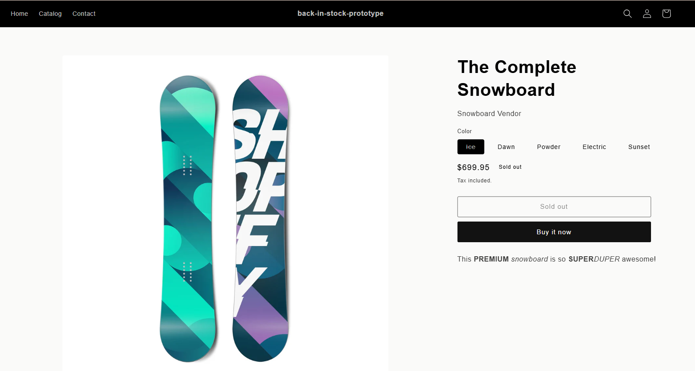
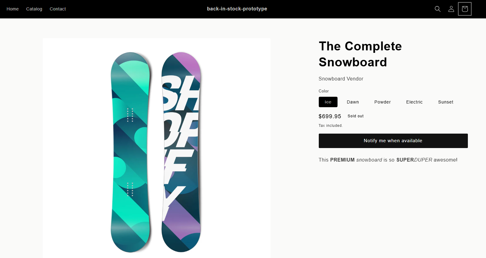
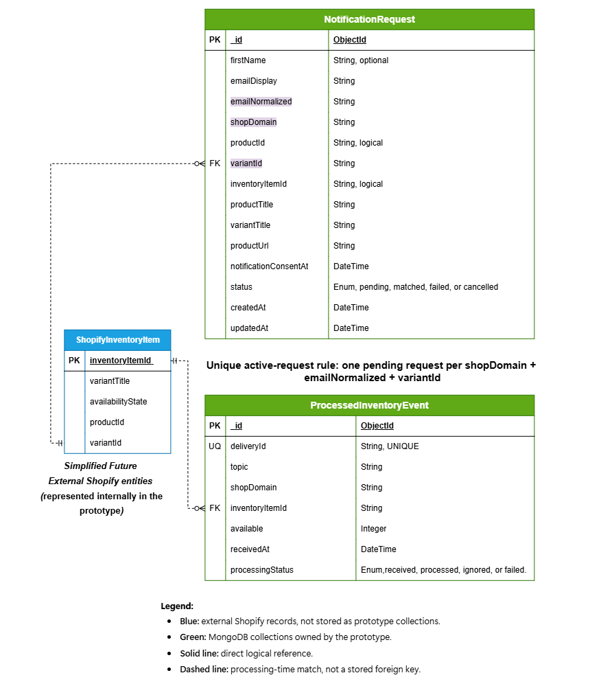
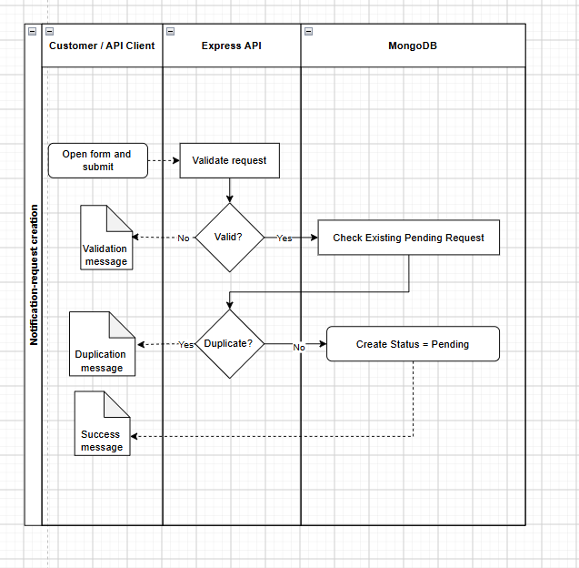
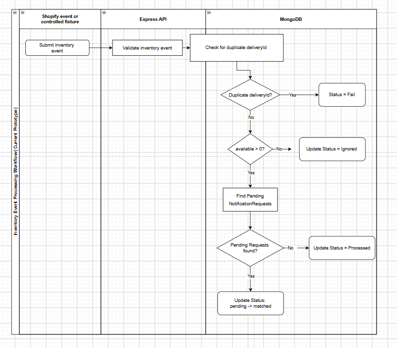
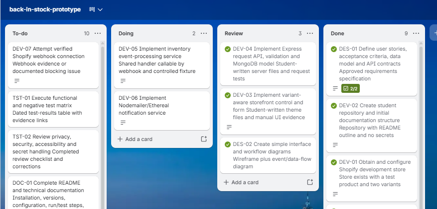

# Building a Privacy-Conscious Back-in-Stock Notification Prototype for Shopify with Node.js, Express, and MongoDB

## Introduction

One of the most common frustrations for e-commerce retailers is losing a sale because a customer finds that the product they wish to purchase is out of stock. In some market niches, customers may return periodically to check whether the item has been restocked. In others, however, customers abandon the purchase altogether and turn to a competitor, often never returning to the original website.

To explore this problem, I developed a prototype Back-in-Stock Notification System using Node.js, Express, and MongoDB. The prototype was designed from an Entity Relationship Diagram (ERD) and focuses on the core workflow of registering notification requests and matching those requests against future inventory updates.

This article explains the problem addressed by the project, the technical and ethical considerations involved, the implementation choices made, the lessons learned throughout development, and areas for future improvement.

## 1. The Problem: Losing Customers to Stockouts

Stockouts are a common problem in e-commerce. When a product is unavailable, customers may leave the store and buy from a competitor. Dadzie and Winston (2007) [1] found that stockouts can negatively affect a customer's assessment of an online transaction and their intention to buy again. 

 *Figure 1. Product Variant - Ice - Unavailable, Sold Out Button*

To address this, merchants need a way to tell customers when a product is available again. This project created a Minimum Viable Product (MVP) prototype. It uses a Node.js, Express server, and a MongoDB database. It uses invented data and a controlled test event to simulate a restock, focusing on the core logic rather than building a full commercial app.

 *Figure 2. Product Variant - Ice - Unavailable, but now with Notify me Button*

## 2. Existing Industry Solutions

Existing Shopify App Store listings from Notify Me! [2], Swym Corporation (n.d.)[3], and Appikon Software Pvt Ltd (n.d.) [4] show that commercial back-in-stock products already exist. 

These commercial apps offer many features like SMS alerts, analytics, and theme customization. But frequently they offer much more than a store needs, and charge for all those features. It can be expensive for a small store.

This prototype project does not try to compete with them. Instead, it deliberately reduces the scope to study how the core event and data workflow operates.

## 3. Technical Issues and Design Choices

To keep the scope manageable and deliver a feasible prototype, this application implements only the backend logic for a stock notification system. The prototype does not send notification emails; instead, it focuses on detecting when a customer has requested a notification and determining whether a positive inventory event should trigger that request. Despite its reduced scope, the system must solve several important technical challenges:

- **Input Validation:** Customers must provide a valid email address and consent to its use for future notifications. To prevent invalid data from entering the system, validation middleware is applied before any data is written to MongoDB. Requests containing malformed email addresses or unsupported fields are rejected with an HTTP 400 response.

- **Event Duplication:** A customer should only be able to create one notification request for a specific product variant. This requirement is enforced through MongoDB uniqueness constraints combined with application-level validation, preventing duplicate records from being created.

- **Duplicate Inventory Events** Inventory systems may generate the same update event more than once. If duplicate events are processed repeatedly, notification requests could be updated incorrectly. To address this issue, each inventory event is assigned a unique deliveryId, which is stored and checked before processing. Events that have already been processed are safely ignored.

- **Event Processing:** An inventory update must only affect notification requests related to the exact product variant that has been restocked. The processing logic uses the `NotificationRequest`, the corresponding `inventoryItemId`, and the `ProcessedInventoryEvent` record to ensure that only relevant requests are considered.

## 4. Ethical and Privacy Considerations

A notification system handles personal data (email addresses), so it must be designed ethically. While this prototype uses only invented test data, several ethical concerns are still relevant.

- **Data Minimization:** The MVP data model is limited to the email address needed for a one-time notification, plus product references and operational timestamps. It does not require a phone number, date of birth, or payment details. This design aligns with the Australian Privacy Principles (APP 3), for which the Office of the Australian Information Commissioner (2026) [5] states that collection must be reasonably necessary.

- **Purpose and Transparency:** The form must clearly state that the email is only for a one-time notification. It should not automatically subscribe the user to general marketing, consistent with the Office of the Australian Information Commissioner (2019) [6].

- **Security:** Secrets (like database passwords) must be kept out of the code repository. They are loaded using environment variables.

- **Accessibility:** The MVP requirements specify clear labels, understandable errors, keyboard operation, visible focus, and text-based status feedback. These are design requirements informed by World Wide Web Consortium guidance (n.d.) [7]. Full accessibility conformance is not claimed because a formal audit has not yet been completed.

## 5. Solution Design

### Data Model
The system needs to remember two main things: the customer's request and the restock event. This is modeled in MongoDB using two collections:

| Entity | Business Fact | Key Attributes |
|--------|---------------|-----------------|
| `NotificationRequest` | A customer wants to know when a specific variant is available. | `_id`, `emailNormalized`, , `variantId`, status (e.g., pending, matched). |
| `ProcessedInventoryEvent` | A restock event was received and must be remembered to prevent duplicates. | `_id`, `deliveryId`, `inventoryItemId`, `available` quantity. |

 *Figure 3. Back-in-Stock System Data Model: Entity Relationship Diagram*

As shown in Figure 3, the ERD separates customer notification requests from inventory events. The `NotificationRequest` collection stores customer details and the product information needed to identify the item being tracked. The `ProcessedInventoryEvent` collection stores inventory updates and prevents duplicate processing. The relationship between the two collections is established through the `inventoryItemId`, allowing the system to identify which notification requests should be triggered when stock becomes available. While the prototype creates test data internally, these product and inventory identifiers are intended to originate from Shopify in a production environment.

### Workflow

The prototype implements a controlled request-submission workflow to ensure that notification requests are complete, valid, and unique. As you can see in the Figure 4, when a customer submits a request to be notified about a product becoming available again, the Express API first validates the submitted data, including the email address, consent flag, and product identifiers. The system then checks whether an active notification request already exists for the same customer, shop, and product variant. If a duplicate request is detected, the request is rejected to prevent redundant records. Otherwise, a new `NotificationRequest` is created with a status of pending, indicating that the customer is waiting for a matching inventory event. This workflow ensures data quality, prevents duplicate requests, and prepares notification records for subsequent inventory-event processing.

*Figure 4. Notification Request Processing Workflow: Core Data Flow*

In the Figure 5, you see when an inventory event is received, the Express API first validates the payload to prevent malformed or invalid data from entering the system. The event is then checked against previously processed records using its unique `deliveryId`, ensuring that duplicate inventory updates are ignored. If the event is valid and indicates that stock is available, the system searches for matching `NotificationRequest` records using the corresponding `inventoryItemId`. Any pending requests associated with the restocked item are updated from `pending` to `matched`, indicating that the customer has become eligible for a future back-in-stock notification. This workflow demonstrates the core business process of matching inventory events to customer requests while leaving email delivery outside the scope of the prototype.

*Figure 5. Inventory Event Processing Workflow: Core Data Flow*

## 6. Technology Selection

The project uses a small JavaScript/Node.js/MongoDB architecture. React was considered but deliberately excluded from this MVP to keep the storefront scope small. Therefore, it would not be accurate to describe the implemented prototype as a full MERN application.

### Node.js

The OpenJS Foundation (n.d.) [8] describes Node.js as an asynchronous, event-driven environment. Node.js was selected for this project because it is widely used for event-driven applications and REST APIs, making it particularly well suited to an inventory notification system where events drive the core workflow. Key benefits include a non-blocking architecture that handles concurrent requests efficiently, a large ecosystem of packages via npm, strong community support, and excellent integration with JavaScript throughout the stack. Because the prototype's core problem domain centers on event-based processing, Node.js aligns naturally with this architecture.

### Express

Express.js (n.d.) [9] provides routing and middleware capabilities for building web servers and APIs. Express was chosen because it provides a lightweight framework that reduces configuration overhead and lets developers focus on business logic rather than framework complexity. Key benefits include minimal configuration requirements, simple and intuitive routing, built-in middleware support for handling cross-cutting concerns, and extensive documentation and community examples. This combination made it straightforward to implement the notification request and inventory event endpoints required by the MVP.

### MongoDB

MongoDB suits the distinct document structures of requests and events required by the system. MongoDB was selected based on prior experience and because the data model closely resembles JSON documents, enabling rapid prototyping and schema flexibility. Key benefits include flexible schema design that evolves with requirements, easy integration with Node.js applications, document-based storage that naturally maps to the `NotificationRequest` and `ProcessedInventoryEvent` entities, and rapid prototyping capabilities. This made it well suited for implementing the entities directly from the Entity Relationship Diagram.

## 7. Project Plan, Testing, and Actual Outcomes

### Project Planning

The project was planned using a Trello board with the stages **To Do**, **Doing**, **Review**, and **Done**. The following plan reduced the solution to one testable workflow instead of attempting a full commercial application. 

| Planned activity |  Purpose |
|------------------|---------|
| Problem, trend, ethics, and comparable-app research | Validate the problem and support technical and ethical discussion with credible sources. |
| Requirements, data model, API contracts, and diagrams | Define a limited, testable MVP before implementation. |
| Storefront and request API implementation | Support the customer request path and server-side validation. |
| Inventory-event processing and controlled fixture testing |  Demonstrate matching, validation, and duplicate-event handling. |
| Email attempt, documentation, article drafting, and final review |Record outcomes honestly, prepare the README, write the article, and complete the evidence and privacy review. |

### Testing Results

Testing focused on the core event-processing logic using controlled, invented data. The following results are recorded in the project evidence log:

| Test Scenario | Expected Result | Actual Result |
|---------------|-----------------|---------------|
| Positive matching event | Store the event and transition one matching pending request to `matched`. | Processed, matched 1, transitioned 1. |
| Duplicate event delivery | Do not repeat the transition. | Duplicate recognized; no second transition. |
| Zero stock event | Do not notify. | Ignored; request stayed pending. |
| Invalid availability value | Reject request. | HTTP 400 error; no event recorded. |

## 8. Student Reflection, Limitations and What Was Attempted

The first step in building a project is identifying a real problem that needs a solution. For this project, the problem came from my interest in e-commerce and customer experience. I wanted to create a notification system that could help customers know when an out-of-stock product becomes available again. At the same time, I wanted to apply concepts learned during my web development studies, including API development, data modelling, database design, and backend architecture.

Before starting this project, I had already completed a full-stack MERN application. Because of that experience, I was already familiar with JavaScript, REST APIs, MongoDB, Express, and designing systems from an ERD. The challenge was not learning these technologies from the beginning, but rather thinking carefully about all the possible business rules and edge cases that could occur, even within a very small prototype scope. This project reinforced that designing a system is not only about building functionality but also about anticipating how the system should behave in different scenarios.

One of the most important learning areas was data modelling. The prototype required a clear distinction between a customer NotificationRequest, an incoming ProcessedInventoryEvent, a unique delivery identifier, request statuses, and inventory references. Mapping these concepts from the ERD into MongoDB collections and Mongoose schemas helped me better understand how application requirements influence database design.

Another important lesson was reliability in software systems. The project included duplicate-event detection using a unique deliveryId. This helped me understand the concept of idempotency, where the same event should not be able to change the system state multiple times if it is received more than once. Although the application is relatively small, this reflects a real-world concern in event-driven systems and distributed applications.

During development, I encountered several technical challenges. One issue involved MongoDB and Mongoose indexes, where an index conflict prevented the application from behaving as expected. Another challenge occurred during inventory matching when notification requests could not be matched because the inventory item identifiers did not correspond correctly. Debugging these problems required careful testing, reviewing database records, and validating assumptions about the data model.

The most significant technical challenge was the implementation of email delivery using Nodemailer and Ethereal. The original goal was to send notification emails when matching inventory became available. The test email component generated a valid Ethereal configuration that was consistent with Nodemailer, but transport verification failed during the local Node.js socket connection stage, producing ESOCKET and connection-related errors before authentication could occur. Additional testing confirmed that the target port was reachable, suggesting that the issue was occurring between the local Node.js environment and the Nodemailer transport configuration. To protect the project scope and timeline, further debugging was postponed. Therefore, no claim of successful email notification delivery is made in this project.

This experience also taught me an important lesson about scope management. Initially, I intended to include a complete email notification workflow, but I realised that continuing to debug an external integration could take significant time away from the primary objective of the project. Instead, I focused on completing and validating the core business workflow. The current prototype successfully registers notification requests, validates incoming data, records inventory events, prevents duplicate processing, matches inventory against pending requests, and updates matching requests from pending to matched. Email delivery remains clearly documented as a future enhancement rather than being presented as a completed feature.

Overall, this project helped me strengthen my understanding of backend development, database design, validation, event processing, and API architecture. It also reinforced the importance of planning realistic project scopes, documenting limitations honestly, and prioritising core functionality before adding advanced features. While the prototype does not yet provide a complete production-ready solution, it successfully demonstrates the main workflow required for a back-in-stock notification system and provides a solid foundation for future development.

## 9. Future Improvements

Although the prototype successfully demonstrates the core inventory-event matching workflow, several areas remain for future development.

One important enhancement would be Shopify webhook integration. The current implementation uses a controlled inventory-event fixture to simulate stock updates. A future version should receive real inventory events directly from Shopify webhooks, allowing the system to operate in a production environment and respond automatically to stock changes.

Another significant improvement is email notification delivery. The original objective included notifying customers when inventory becomes available; however, email delivery was deferred due to technical challenges encountered with the development SMTP environment. Future work could integrate a production-ready email service and extend the notification lifecycle from pending to matched and finally to sent.

The project could also benefit from retry mechanisms for failed notifications. In a production system, temporary failures such as network interruptions or service outages should not prevent customers from receiving notifications. Implementing controlled retry logic would improve reliability and fault tolerance.

Finally, queue-based event processing could be introduced to improve scalability and performance. Rather than processing inventory events immediately within the API request, events could be placed in a queue and processed asynchronously. This approach would support higher transaction volumes and better reflect modern event-driven architectures used in large-scale e-commerce platforms.

While these features remain outside the scope of the current MVP, the existing prototype provides a solid foundation for future development. The core data model, validation rules, event-processing workflow, and request-matching logic have been implemented and tested, making it easier to extend the system with additional functionality in later iterations.

## References

[1] Dadzie, K.Q. and Winston, E. (2007) ‘Consumer response to stock-out in the online supply chain’, International Journal of Physical Distribution & Logistics Management, 37(1), pp. 19–42. Available at: https://www.emerald.com/ijpdlm/article/37/1/19/162646 (Accessed: 20 July 2026).

[2] Notify Me! (n.d.) Notify Me! for back in stock alert, backorder, out of stock waiting list, low stock alert & wishlist. Shopify App Store. Available at: https://apps.shopify.com/preorder-back-in-stock (Accessed: 20 July 2026).

[3] Swym Corporation (n.d.) Swym Back in Stock Alerts. Shopify App Store. Available at: https://apps.shopify.com/watchlist (Accessed: 20 July 2026).

[4] Appikon Software Pvt Ltd (n.d.) Appikon – Back In Stock. Shopify App Store. Available at: https://apps.shopify.com/customer-back-in-stock-alert-user-notification-app (Accessed: 20 July 2026).

[5] Office of the Australian Information Commissioner (2026) Chapter 3: APP 3 Collection of solicited personal information. Available at: https://www.oaic.gov.au/privacy/australian-privacy-principles/australian-privacy-principles-guidelines/chapter-3-app-3-collection-of-solicited-personal-information (Accessed: 20 July 2026).

[6] Office of the Australian Information Commissioner (2019) Chapter 5: APP 5 Notification of the collection of personal information. Available at: https://www.oaic.gov.au/privacy/australian-privacy-principles/australian-privacy-principles-guidelines/chapter-5-app-5-notification-of-the-collection-of-personal-information (Accessed: 20 July 2026).

[7]World Wide Web Consortium (n.d.) Understanding SC 3.3.2: Labels or Instructions (Level A). Available at: https://www.w3.org/WAI/WCAG22/Understanding/labels-or-instructions.html (Accessed: 20 July 2026).

[8] OpenJS Foundation (n.d.) About Node.js. Available at: https://nodejs.org/en/about (Accessed: 20 July 2026).

[9] Express.js (n.d.) Using middleware. Available at: https://expressjs.com/en/5x/guide/using-middleware/ (Accessed: 20 July 2026).
