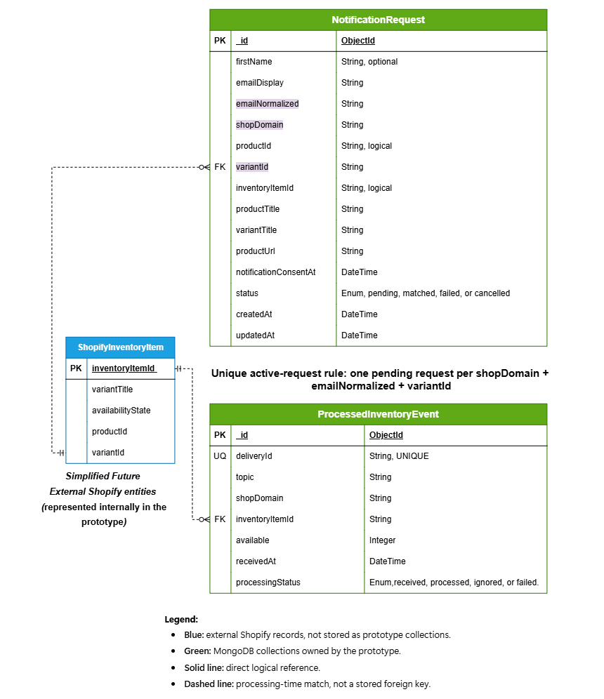
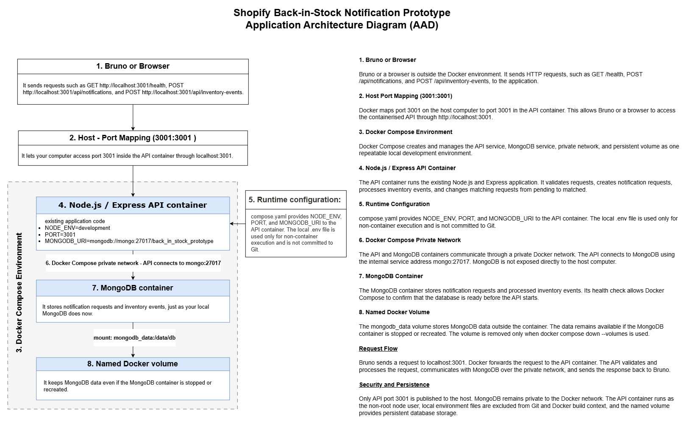
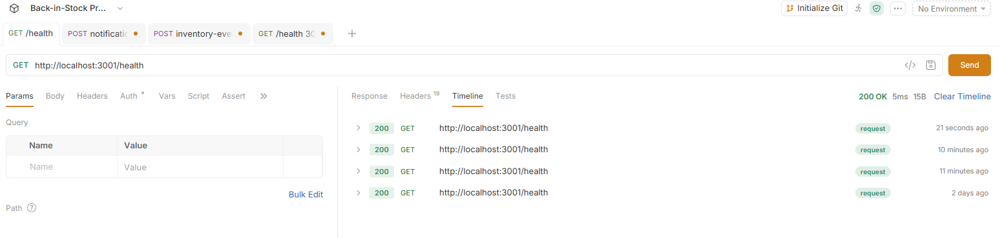
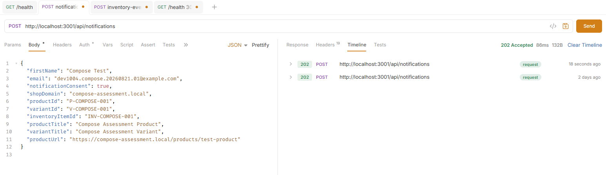
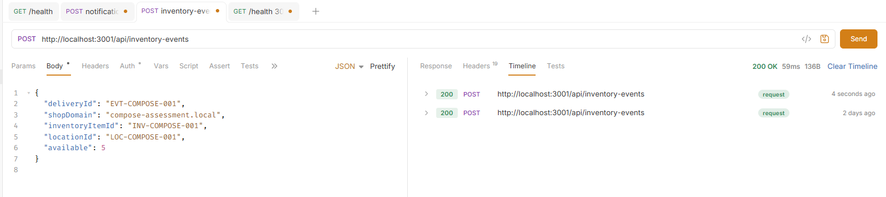
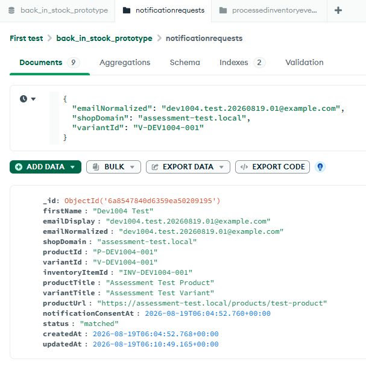
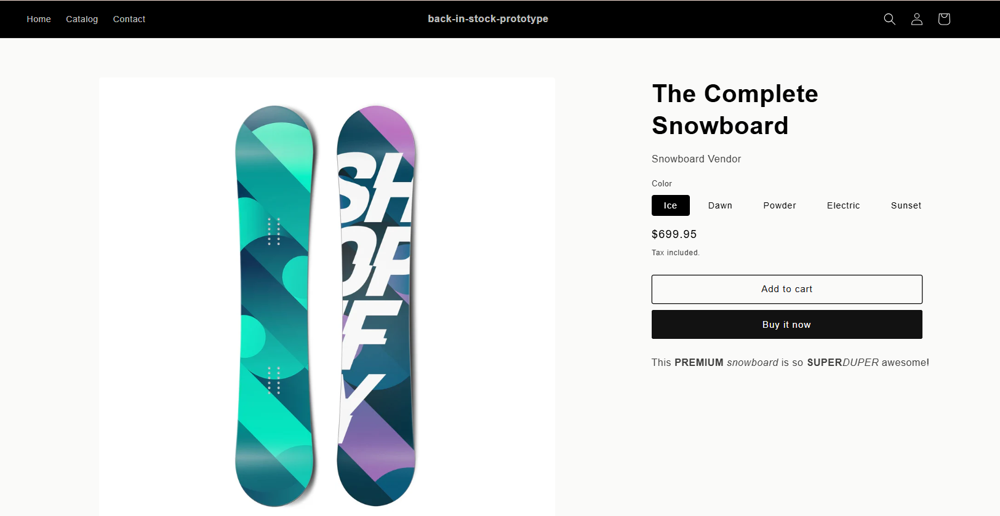
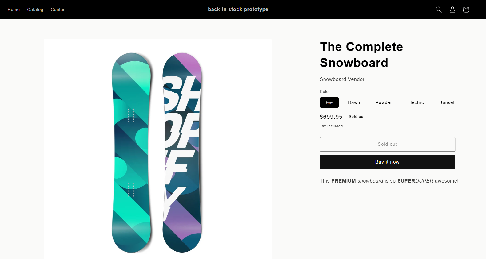
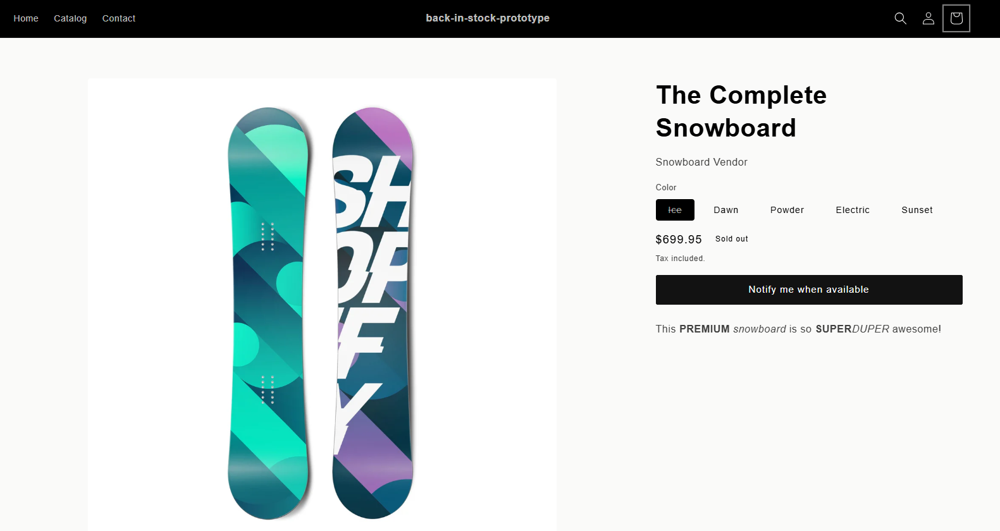
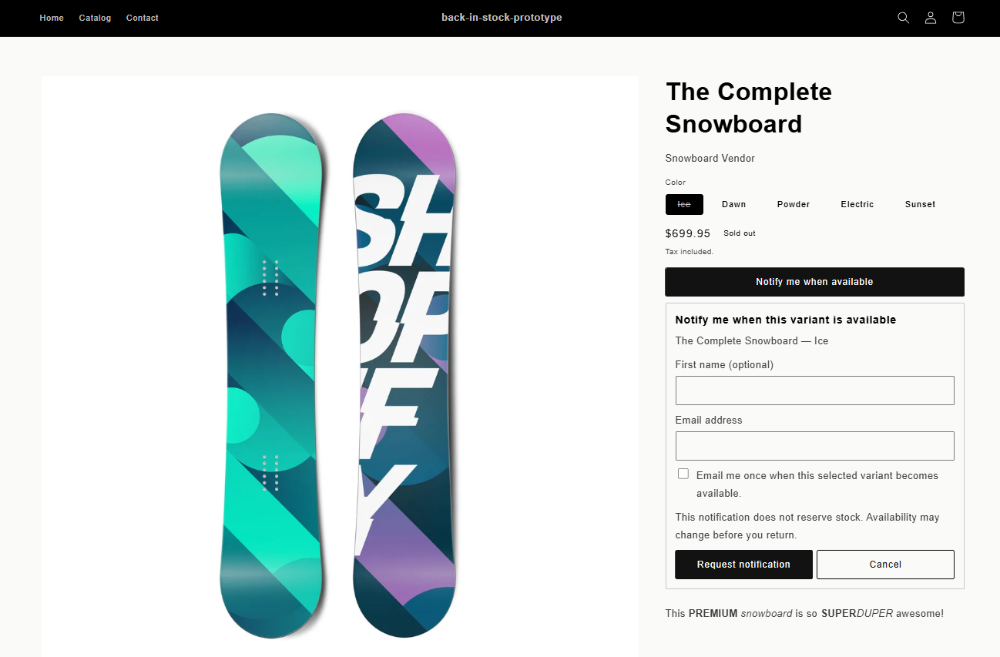

# Shopify Back-in-Stock Notification Prototype - Usage & Installation Guide

## Table of Contents
1. [Project Overview](#1-project-overview)
2. [Project Structure](#2-project-structure)
3. [Prerequisites](#3-prerequisites)
4. [Installation & Setup](#4-installation--setup)
5. [API Endpoints](#5-api-endpoints)
6. [Testing with Bruno](#6-testing-with-bruno)
7. [Docker Development Environment](#7-docker-development-environment)
8. [Code Documentation](#8-code-documentation)
9. [Future Enhancements](#9-future-enhancements)

---

## 1. Project Overview

This repository contains an **API-focused prototype** for a Shopify-style back-in-stock notification workflow. The application is built with Node.js, Express, MongoDB, and Mongoose. It exposes HTTP endpoints for receiving notification requests, processing development inventory events, and checking service health. Security and request-handling middleware are provided by Helmet, CORS, and Express JSON parsing.

The implemented workflow allows a customer to register interest in an unavailable product variant. During development, an inventory-event endpoint can simulate a stock update. When an event reports positive availability for the same shop domain and inventory item, the application finds matching pending notification requests and changes their status to `matched`. MongoDB persists both notification requests and processed inventory events, including duplicate-event protection. 

The project can run directly with Node.js and MongoDB or in a containerised local environment. The Docker configuration builds a versioned API image and uses Docker Compose to run two services: the Express API and MongoDB. Compose publishes only the API on port `3001`, places both services on a private bridge network, waits for a healthy MongoDB service before starting the API, and stores database data in the named `mongodb_data` volume.

### Current Scope

| Implemented in this prototype | Intentionally not implemented |
| --- | --- |
| Notification-request registration and validation | Live Shopify API integration |
| Development-only inventory-event simulation | Shopify webhook reception |
| Matching pending requests to positive inventory updates | Email or other customer-notification delivery |
| Duplicate request and duplicate event prevention | Production queueing, retries, and notification delivery tracking |
| MongoDB persistence, API health check, and error handling | A storefront user interface or production deployment |
| Dockerfile, Docker Compose environment, private service network, and persistent MongoDB volume |  |

The repository uses invented test data and is intended for educational and prototype purposes. It must not be used with real customer information or production credentials.

---

## 2. Project Structure

### ERD



BACK-TO-STOCK-PROTOTYPE-SHOPIFY

The repository separates application code, Docker configuration, documentation, and supporting visual assets. The `src/` directory contains the runtime API; the Docker files at the repository root define the containerised environment; and the documentation and image folders provide supporting material rather than application runtime dependencies.

```text
back-in-stock-prototype-shopify/
├── src/                                      # Express API source code
│   ├── app.js                                # Express setup, middleware, health route, and route mounting
│   ├── server.js                             # MongoDB connection and HTTP server startup
│   ├── config/
│   │   ├── database.js                       # Database connection configuration
│   │   └── env.js                            # Environment-variable loading and validation
│   ├── controllers/
│   │   ├── inventoryFixtureController.js     # Development inventory-event endpoint controller
│   │   └── notificationRequestController.js  # Notification-request controller
│   ├── middleware/
│   │   ├── errorHandler.js                   # Not-found and application error handling
│   │   ├── validateInventoryFixtureEvent.js  # Inventory-event request validation
│   │   └── validateNotificationRequest.js    # Notification-request validation
│   ├── models/
│   │   ├── NotificationRequest.js            # Mongoose model for customer requests
│   │   └── ProcessedInventoryEvent.js        # Mongoose model for idempotent event processing
│   ├── routes/
│   │   ├── inventoryFixtureRoutes.js         # Development inventory-event routes
│   │   └── notificationRoutes.js             # Notification-request routes
│   └── services/
│       └── inventoryEventService.js           # Inventory-event matching logic
│
├── Dockerfile                                # Builds the Node.js API image and defines its health check
├── compose.yaml                              # Runs the `api` and `mongo` services, network, and data volume
├── .dockerignore                             # Removes non-runtime files from the Docker build context
├── .env.example                              # Example local environment-variable configuration
├── package.json                              # Project metadata, scripts, and dependencies
├── package-lock.json                         # Locked dependency versions for repeatable npm installs
├── Documentation/                            # Supporting report and editable architecture source diagram
│   ├── 16097_BorgesAmaral_Lorena_ISK1002_A2.md
│   └── DEV1004_AAD.drawio
├── _img/                                     # Rendered diagrams and prototype screenshots used by the README/docs
│   ├── DEV1004_AAD.drawio.png
│   ├── InventoryEventDataflow.drawio.png
│   ├── NotificationRequestDataflow.drawio.png
│   └── ...
├── README.md                                 # Installation, API, Docker, and project documentation
└── .gitignore                                # Git exclusions, including the local `.env` file
```

## 3. Prerequisites

### Software
The project can be run either in the recommended Docker Compose environment or directly with Node.js. Choose one of the two options below.

| Requirement| Required for Docker Compose | Required for direct Node.js run | Purpose |
|---|---|---|---|
| Git| Yes| Yes| Clone the repository.|
| Docker Desktop, or Docker Engine with the Docker Compose plugin | Yes| No | Build and run the API and MongoDB containers.|
| Node.js 22.x and npm| No| Yes| Install dependencies and run the Express API directly.|
| MongoDB Atlas account or local MongoDB instance| No| Yes| Provide database persistence when not using Docker Compose. |
| Bruno, Postman, curl, or another HTTP client| Optional| Optional| Test the health and API endpoints.|

Verify installation:

```bash
# Docker Compose route
docker --version
docker compose version

# Direct Node.js route
node -v
npm -v
```

### Hardware and network
A standard desktop or laptop capable of running Node.js and accessing a MongoDB development database is sufficient. No performance benchmark or minimum hardware specification has been completed for this MVP.

### Required knowledge
You should be comfortable with basic command-line use, Node.js package installation, HTTP requests, and MongoDB connection strings. The project uses only invented test data. Do not use a real customer email address, real Shopify customer data, or production credentials.

## 4. Installation & Setup

### Step 1: Clone the Repositories

```bash

git clone https://github.com/lorenaborges256/back-in-stock-prototype-shopify.git

cd back-in-stock-prototype-shopify
```

### Step 2: install packages

```bash
npm ci
```
### Step 3: Create the local environment file .env

```bash
NODE_ENV=development
PORT=3001
MONGODB_URI=mongodb://127.0.0.1:27017/back_in_stock_prototype
```

### Step 4: Start application

```bash
npm run dev
```
You should see:

```
MongoDB connection established.
Back-in-stock API listening on port 3001.
```

## 5. API Endpoints

### A. Health Check

Use Bruno or another HTTP client to send a request to the health endpoint:
```
GET http://localhost:3001/health
```

Response:

```json
{
  "status": "ok"
}
```

### B. Create Notification Request

Request
```
POST http://localhost:3001/api/notifications
``` 
Body `<JSON>`
```json
{
  "firstName": "John",
  "email": "john@example.com",
  "notificationConsent": true,
  "shopDomain": "sports-shop.local",
  "productId": "P100",
  "variantId": "V100",
  "inventoryItemId": "INV100",
  "productTitle": "Nike Air Runner",
  "variantTitle": "Size 10",
  "productUrl": "https://sports-shop.local/products/nike-air-runner"
}
```
Response:
```json
{
  "message": "Your notification request has been received. If an active request already exists, another request will not be created."
}
```

### C. Create Inventory Event

Development-only endpoint.

```
POST http://localhost:3001/api/inventory-events
```
Example body:
```json
{
  "deliveryId": "EVT-001",
  "shopDomain": "sports-shop.local",
  "inventoryItemId": "INV100",
  "locationId": "LOC001",
  "available": 5
}
```
Example response:

```json
{
  "message": "The inventory event was processed successfully.",
  "outcome": "processed",
  "matchedRequestCount": 1,
  "transitionedRequestCount": 1
}
```
## 6. Testing with Bruno

- Step 1 - Create a notification request:
Request
```
POST http://localhost:3001/api/notifications
``` 
Body `<JSON>`
```json
{
  "firstName": "John",
  "email": "john@example.com",
  "notificationConsent": true,
  "shopDomain": "sports-shop.local",
  "productId": "P100",
  "variantId": "V100",
  "inventoryItemId": "INV100",
  "productTitle": "Nike Air Runner",
  "variantTitle": "Size 10",
  "productUrl": "https://sports-shop.local/products/nike-air-runner"
}
```
Response:
```json
{
  "message": "Your notification request has been received. If an active request already exists, another request will not be created."
}
```

- Step 2 - Create an inventory event with the same `inventoryItemId`:
```
POST http://localhost:3001/api/inventory-events

```
Body `<JSON>`
```json
{
  "deliveryId": "EVT-001",
  "shopDomain": "sports-shop.local",
  "inventoryItemId": "INV100",
  "locationId": "LOC001",
  "available": 5
}
```

- Step 3 - Observe the response on :

```json
{
  "outcome": "processed",
  "matchedRequestCount": 1,
  "transitionedRequestCount": 1
}
```
In MongoDB Compass, connect to the `back_in_stock_prototype` database and open the `notificationrequests` collection. Locate the notification request created with the test email address, such as `john@example.com`. Confirm that the document contains `inventoryItemId: "INV100"` and that its `status` has changed from `"pending"` to `"matched"` after the inventory event is processed. Then open the `processedinventoryevents` collection and confirm that an event with `deliveryId: "EVT-001"` has been recorded with `processingStatus: "processed"`. This verifies that the application saved the notification request, received the inventory update, and successfully matched the two records.

## 7. Docker Development Environment

The application can be run in a repeatable Docker development environment. The `api` service runs the Node.js and Express application, while the `mongo` service provides MongoDB persistence. Docker Compose creates a private bridge network so the API can connect to MongoDB using the service hostname `mongo`. Only the API is exposed to the host machine on port `3001`; MongoDB remains private to the Docker network.

### 7.1 Container Files

| File | Purpose |
| --- | --- |
| `Dockerfile` | Builds a versioned Node.js API image and starts the application with `npm start`. |
| `compose.yaml` | Defines the API and MongoDB services, environment variables, port mapping, health checks, private network, and persistent volume. |
| `.dockerignore` | Excludes local dependencies, environment files, Git metadata, logs, documentation, and other unnecessary files from the Docker build context. |
| `.env` | Local-only runtime configuration for non-container execution. This file is ignored by Git and must not contain committed secrets. |

### 7.2 Image Naming and Tags

The API image uses the consistent local image name and semantic version tag shown below:

```bash
docker build --tag back-in-stock-api:1.0.0 .
```

The repository name, `back-in-stock-api`, identifies the application component. The version tag, `1.0.0`, identifies the build version. The Dockerfile also uses deliberate base-image versioning with `node:22.13.0-alpine`, rather than an unversioned `latest` tag. The Compose database service uses the versioned `mongo:8.0` image.

### 7.3 Environment Variables and Security

| Variable | API-only local value | Docker Compose value | Purpose |
| --- | --- | --- | --- |
| `NODE_ENV` | `development` | `development` | Enables the development-only inventory-event simulation route for testing. |
| `PORT` | `3001` | `3001` | Sets the Express API listening port. |
| `MONGODB_URI` | `mongodb://127.0.0.1:27017/back_in_stock_prototype` | `mongodb://mongo:27017/back_in_stock_prototype` | Sets the database connection address. Docker Compose uses the internal service hostname `mongo`. |

The local `.env` file is excluded from Git and Docker build context. No production credentials are stored in this repository. The container runs as the non-root `node` user, Docker exposes only the API port, and the MongoDB port is not published to the host machine.

### 7.4 Build and Run Commands

Start the complete Docker Compose development environment:

```bash
docker compose up --build --detach --wait
```

Check service status:

```bash
docker compose ps
```

View API logs:

```bash
docker compose logs --tail=50 api
```

Test the containerised API health endpoint:

```text
GET http://localhost:3001/health
```

Stop the services while preserving the MongoDB named volume:

```bash
docker compose down
```

Remove the services and the named volume when a complete database reset is required:

```bash
docker compose down --volumes
```

### 7.5 Docker Architecture and Verification



The application architecture diagram in `Documentation/DEV1004_AAD.drawio` represents the Docker Compose environment. A Bruno client or browser sends HTTP requests to host port `3001`, which Docker forwards to the Node.js and Express API container. The API receives `NODE_ENV`, `PORT`, and `MONGODB_URI` at runtime. It connects to the MongoDB container through the private Docker network using `mongo:27017`. The MongoDB container stores persistent data in the named `mongodb_data` volume.

The solution was verified by building the `back-in-stock-api:1.0.0` image, running it as an individual container, and receiving `200 OK` from `/health`. 



The Compose environment was then started successfully with healthy API and MongoDB services. A notification request was accepted with `202 Accepted`, a matching inventory event returned `200 OK` with one matched and transitioned request, and the private MongoDB container confirmed the final `matched` notification status and `processed` inventory-event status.

Bruno Evidence:




MongoDB Compass Notification Request Matched Status, after Notification Request and Inventory Event been registred.



## 8. Code Documentation

The project includes comments throughout the codebase to explain:

- Route responsibilities
- Validation logic
- Inventory event processing
- Error handling
- Database initialization

Examples include:

```js
/**
* Creates a back-in-stock notification request.
*/
```
and

```js
/**
* Development-only endpoint used to simulate
* inventory updates.
*/
```

These comments assist future developers in understanding the purpose and behaviour of each component.

## 9. Future Enhancements
Potential future improvements include:

- Shopify webhook integration
- Email notification delivery
- Retry mechanisms for failed notifications
- Queue-based event processing

 Product Variant - ICE - Available

 Product Variant - ICE - Unavailable, Sold Out Button

 Product Variant - ICE - Unavailable Notify-me Button

 Product Variant - ICE - Notify-me Form